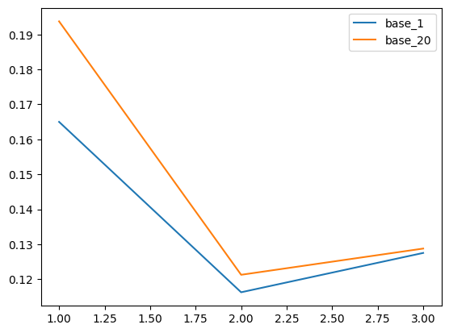

Automatic Selection for Batch-mode Experimentation
================

<!-- WARNING: THIS FILE WAS AUTOGENERATED! DO NOT EDIT! -->

Created with nbdev by Zoltan Puha

## Install

`python -m pip install  git+https://github.com/puhazoli/asbe`

## How to use

ASBE builds on the functional views of modAL, where an AL algorithm can
be run by putting together pieces. You need the following ingredients: -
an ITE estimator (`ITEEstimator()`), - an acquisition function, - and an
assignment function. - Additionaly, you can add a stopping criteria to
your model. If all the above are defined, you can construct an
`ASLearner`, which will help you in the active learning process.

``` python
from asbe.base import *
from asbe.models import *
from sklearn.linear_model import LogisticRegression
from sklearn.ensemble import RandomForestClassifier
import numpy as np
```

``` python
N = 1000
X = np.random.normal(size = N*2).reshape((-1,2))
t = np.random.binomial(n = 1, p = 0.5, size = N)
y = np.random.binomial(n = 1, p = 1/(1+np.exp(X[:, 1]*2 + t*3)))
ite = 1/(1+np.exp(X[:, 1]*2 + t*3)) - 1/(1+np.exp(X[:, 1]*2))
a = BaseITEEstimator(LogisticRegression(solver="lbfgs"))
a.fit(X_training=X, t_training=t, y_training=y)
```

## Learning actively

Similarly, you can create an
[`BaseActiveLearner`](https://puhazoli.github.io/asbe/base.html#baseactivelearner),
for which you will initialize the dataset and set the preferred modeling
options. Let’s see how it works: - we will use XBART to model the
treatment effect with a one-model approach - we will use expected model
change maximization - for that, we need an approximate model, we will
use the `SGDRegressor`

You can call `.fit()` on the
[`BaseActiveLearner`](https://puhazoli.github.io/asbe/base.html#baseactivelearner),
which will by default fit the training data supplied. To select new
units from the pool, you just need to call the `query()` method, which
will return the selected `X` and the `query_ix` of these units.
[`BaseActiveLearner`](https://puhazoli.github.io/asbe/base.html#baseactivelearner)
expects the `n2` argument, which tells how many units are queried at
once. For sequential AL, we can set this to 1. Additionally, some query
strategies can require different treatment effect estimates - EMCM needs
uncertainty around the ITE. We can explicitly tell the the
[`BaseITEEstimator`](https://puhazoli.github.io/asbe/base.html#baseiteestimator)
to return all the predicted treatment effects. Then, we can teach the
newly acquired units to the learner, by calling the `teach` function.
The `score` function provides an evaluation of the given learner.

``` python
from sklearn.model_selection import train_test_split
from sklearn.linear_model import SGDRegressor
from copy import deepcopy
import pandas as pd
```

``` python
X_train, X_test, t_train, t_test, y_train, y_test, ite_train, ite_test = train_test_split(
    X, t, y, ite,  test_size=0.8, random_state=1005)
ds = {"X_training": X_train,
     "y_training": y_train,
     "t_training": t_train,
     "ite_training": np.zeros_like(y_train),
     "X_pool": deepcopy(X_test), 
     "y_pool": deepcopy(y_test),
     "t_pool": deepcopy(t_test),
     "ite_pool" : np.zeros_like(y_test),
     "X_test": X_test,
     "y_test": y_test,
      "t_test": t_test,
      "ite_test": ite_test
     }
asl = BaseActiveLearner(estimator = BaseITEEstimator(model = RandomForestClassifier(),
                                         two_model=False),
                        acquisition_function=BaseAcquisitionFunction(),
                        assignment_function=BaseAssignmentFunction(),
                        stopping_function = None,
                        dataset=ds)
asl.fit()
X_new, query_idx = asl.query(no_query=10)
asl.teach(query_idx)
preds = asl.predict(asl.dataset["X_test"])
asl.score()
```

    0.34842037641629464

``` python
asl = BaseActiveLearner(estimator = BaseITEEstimator(model = RandomForestClassifier(),
                                         two_model=True),
                        acquisition_function=[BaseAcquisitionFunction(),
                                             BaseAcquisitionFunction(no_query=20)],
                        assignment_function=BaseAssignmentFunction(),
                        stopping_function = None,
                        dataset=ds,
                        al_steps = 3)
resd = pd.DataFrame(asl.simulate(metric="decision"))
```

``` python
resd.plot()
```

    <AxesSubplot:>


